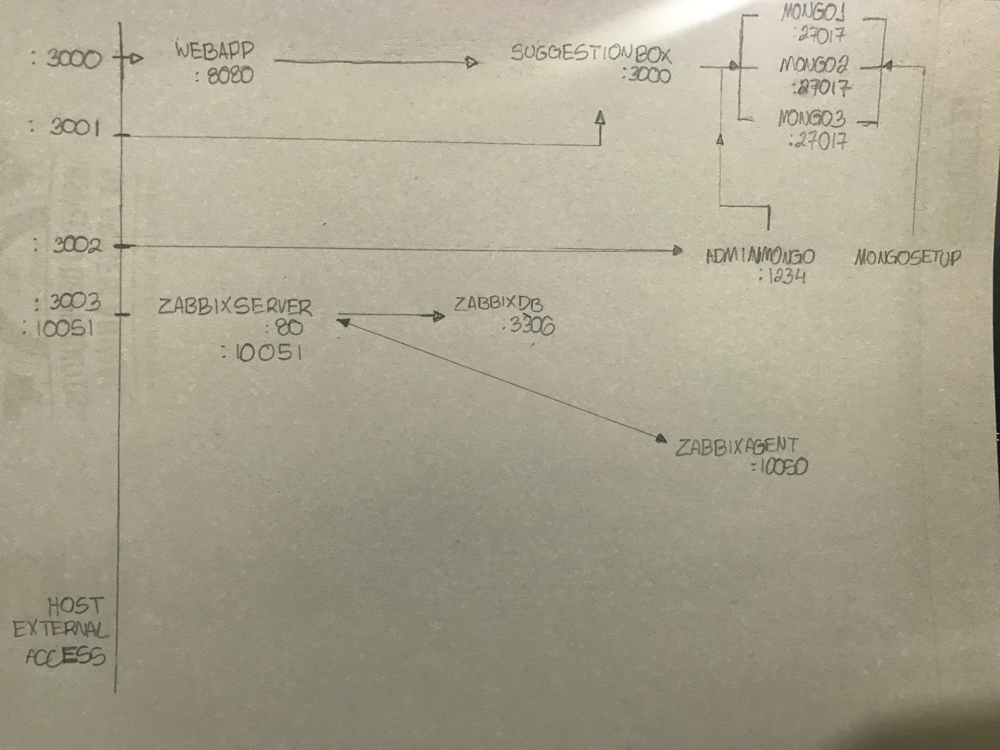
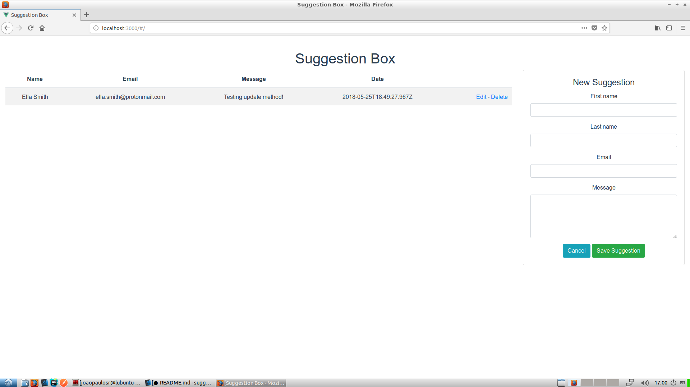
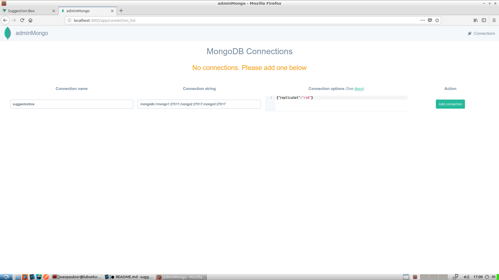
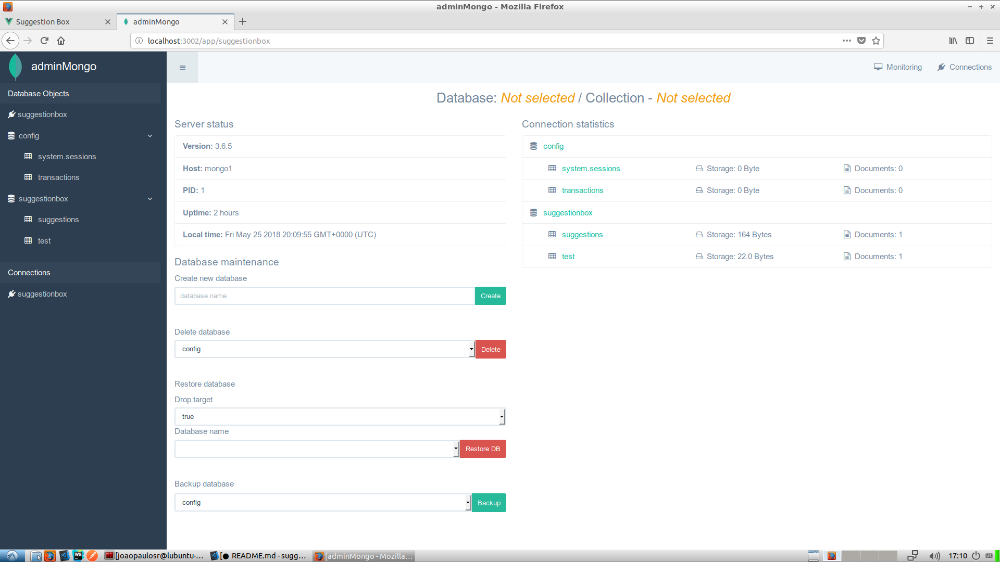

# suggestion box
(incomplete project)

* author: João Paulo Bastos <joaopaulosr95@gmail.com>
* license: GPL

## Preliminary notes
Hi,

In this projet you will find a abunch of services that together compose a high-availability Docker stack for a suggestion box web app.

In docker-compose.yml there are described the services, volumes, ports etc etc, check it out :)

**It seems awesome, how can I set this playground up?**
Calm down, you will know it soon

There are a complete list of commands in Makefile that you can run in order to get everything up and running easily.


The above diagram is an attempt to illustrate how things interact and which ports are exposed. I prefered to draw it manually because, well, I like to draw diagrams manually xD (Keep in mind that it's a bare working prototype)

There are three major groups and they will be explained separatedly in a proper way.

## webapp
According to Makefile, `webapp` is composed by

    wepapp:
        docker-compose start suggestionbox webapp

### backend - suggestionbox
The suggestionbox container provides an simple REST API on http://localhost:3001 (check docker-compose.yml for more details). It is built with Express and TypeScript above NodeJS and responds on the endpoints below:

#### Create a new suggestion

Parameters:

- id: ObjectID string from Mongo
- firstName: String
- lastName: String
- email: String
- message; String

Request:

    curl -H "Content-Type: application/json" \
      -d '{"firstName": "Ella", "lastName": "Smith", "email": "ella.smith@protonmail.com", "message": "Just testing :)"}' \
      -X POST http://localhost:3001/suggestions/

Response:
```json
{
    "_id": "5b085ab7da77b8004108770b",
    "firstName": "Ella",
    "lastName": "Smith",
    "email": "ella.smith@protonmail.com",
    "message": "Just testing :)",
    "updated_at": "2018-05-25T18:49:27.967Z",
    "__v": 0
}
```


#### Retrieve all the suggestions

Request:

    curl -X GET http://localhost:3001/suggestions/

Response:
```json
[
    {
        "_id": "5b085ab7da77b8004108770b",
        "firstName": "Ella",
        "lastName": "Smith",
        "email": "ella.smith@protonmail.com",
        "message":"Just testing :)",
        "updated_at": "2018-05-25T18:49:27.967Z",
        "__v":0
    }
]
```

#### Retrieve a specific suggestion

Request:

    curl -X GET http://localhost:3001/suggestions/5b085ab7da77b8004108770b

Parameters:

- id: ObjectID string from Mongo

Response:
```json
{
    "_id": "5b085ab7da77b8004108770b",
    "firstName": "Ella",
    "lastName": "Smith",
    "email": "ella.smith@protonmail.com",
    "message": "Just testing :)",
    "updated_at": "2018-05-25T18:49:27.967Z",
    "__v": 0
}
```


#### Update a suggestion

Parameters:

- id: ObjectID string from Mongo
- firstName: String
- lastName: String
- email: String
- message; String

Request:

    curl -H "Content-Type: application/json" \
      -d '{"firstName": "Ella", "lastName": "Smith", "email": "ella.smith@protonmail.com", "message": "Testing update method!"}' \
      -X PATCH http://localhost:3001/suggestions/5b085ab7da77b8004108770b

Response:
```json
{
    "_id": "5b085ab7da77b8004108770b",
    "firstName": "Ella",
    "lastName": "Smith",
    "email": "ella.smith@protonmail.com",
    "message": "Testing update method!",
    "updated_at": "2018-05-25T18:49:27.967Z",
    "__v": 0
}
```

### frontend - webapp
The webapp container provides an single-page application on http://localhost:3000 (check docker-compose.yml for more details). It is build with VueJS above NodeJS and presents out CRUD app with a list of suggestions and a form to create new suggestions such as edit previous ones.



## mongo
According to Makefile, `mongo` is composed by

    mongo:
        docker-compose start mongo1 mongo2 mongo3 && sleep 10
	    docker-compose start mongosetup && sleep 10
	    docker-compose start adminmongo

### mongo1, mongo2 and mongo 3
These are basic mongo instances with no proper Dockerfiles and no port exposure to the outside world.

### mongosetup
He is the magician one :D Thanks [@mrvautin](https://github.com/mrvautin/adminMongo)
This container is also a mongo container but has its own Dockerfile. It is in charge of setting up a mongo replica set named `rs0` (check mongo/mongosetup for more details).  basically waits until both `mongo1, mongo2, mongo3` come online and than ties them all.

### adminmongo
This is an extra container that provides a nice GUI for mongo administration.

First of all you need to specify a connection name, a mongodb url and the connection parameters, just like in the example.



Then click in "Add connection" and "Connect" in the row later row that appears right above the connection setup line.

[Adminmongo connecting from May 25th, 2018](resources/adminmongo_2.png)

Finally you will be presented a complete interface to <del>destroy your</del> manage your database with a friendly GUI.



## zabbix
This is a TODO feature, Zabbix provides us low-level monitoring and service discovery.

According to Makefile, `zabbix` is composed by

    zabbix:
        docker-compose start zabbixdb && sleep 5
	    docker-compose start zabbixserver && sleep 60
	    docker-compose start zabbixagent

### zabbixdb
This is an tunned mariadb image from [@monirotingartist](https://github.com/monitoringartist/dockbix-xxl), needed for Zabbix to store its configurations and data.

### zabbixagent
Thanks to [@monitoringartist](https://github.com/monitoringartist/dockbix-xxl), this is "an active monitor of local resources and applications (hard drives, memory, processor statistics etc)". Once up we need about 60 seconds for it to connect to mariadb and be ready for connection with agent.

### zabbixserver
Running on http://localhost:3003 (web interface) and http://localhost:10051 (communication with agent), this is the core of Zabbix. Thanks again to [@monitoringartist](https://github.com/monitoringartist/dockbix-xxl) this image is a improved version that includes a lot of community templates to ease monitoring steps.

## Adventure time!
Going back to Makefile you can simply run

    make

and the required volume folders and containers will be created. After this, Makefile will even bring the whole cluster up.

* Important note: During setup process you will be shown some NPM warnings about fsevents module. They are thrown because nodemon depends on fsevents and the seecond one only makes sense in a OSX environment.


If you want to wipe everything it's also very simple. The commands below will destroy all the containers and their data, so you can start over.

    make drop # bring down the cluster
    make clean-all # wipe data

Feel free to read it and use the combinations that fit better your needs.
